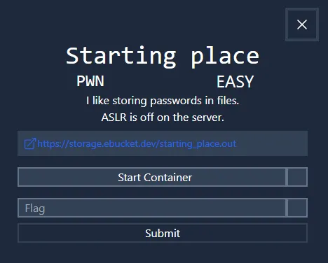
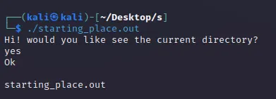
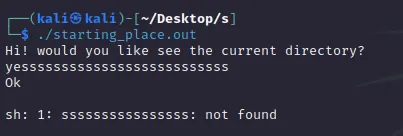
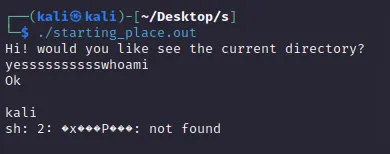
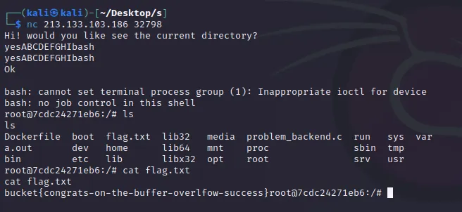
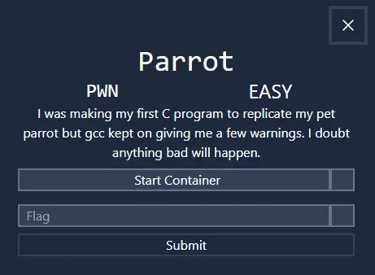

A really cool CTF I played on some random weekend, so cool I couldn’t resist creating a writeup.

### Starting Place, Easy **—** Pwn



We have been provided with a *32-bit* executable, which upon running, lists the current directory.



Before I even look at it with *ghidra*, I decided to test its response when I provide it with ‘too many’ characters.



We got an `sh` error, which technically means `/bin/sh` tried to execute `ssss...`, and that is not a valid command. So, if I find the *offset* from which the next characters are going to be run by the `sh` command, then I can get command execution.



The `whoami` command executed successfully, so I can try this on our server.



Here is the vulnerable code:

```c
#include <stdio.h>
#include <stdlib.h>
#include <string.h>
#include <unistd.h>

int main()
{
    //initializing stuff 
    char command[20];
    char input_buf[12];
    strcpy(command, "ls");

    puts("Hi! would you like see the current directory?");

    read(0, input_buf, 28);

    if (!strcmp(input_buf, "no\n")) {
        puts("ok");
        exit(0);
    }

    puts("Ok \n");
    system(command);

}
```

### Parrot, Easy **—** Pwn



Immediately you initiate a connection to the challenge, the program waits for you to provide input. This was at first confusing, but as soon as I inputted something, I saw the response.


I tried various inputs until I provided a `%s` and got a *weird* response.


The program is vulnerable to a *format string attack*, and that’s because it referenced the pointer to the string `Hello`. This can be exploited by providing more `%s` that will try to reference other string pointers in the buffer. After several attempts, I got a flag.


### **Minecraft, Easy — Misc**


The `.mcworld` is a Minecraft extension, and the file is technically an *archive*. After extraction, I ran a recursive `grep` which revealed a flag.


One-liner:


### **Image-2, Easy — Misc**


There are many ways to analyze images, and for our image, I stopped at the `strings` command.


### **Detective, Easy — Misc**


Another image. Same old steps. I run `open` first, and I noticed it was a *plain* *white* image. For the next step, I decided to run `xxd`, because I wanted to know if maybe there was some excessive padding of *white characters(0xff)*. Looking at the `xxd`dump, there were so many rows consistent with pure ‘*0xff’* characters, but not all of them. Below, I’ve listed the first 10 rows.


My next thought was to create a new image having removed all the pure-white 16-byte rows. To my surprise (literally), the new image had something for us.


It is not very clear, but it can be typed out. You could produce a more clear image by removing more white characters by passing the string `ffff` to the `grep`cmd i.e. `grep -v 'ffff'`

TIP: The flag could easily be obtained using `stegsolve`, by switching to different colour planes, but I thought this was more fun to show.

### **Transmission, Easy — Misc**


When you look at the image using a normal image viewer, there’s almost nothing to observe, except a very thin strand at the centre that is hardly viewable. Initially, I tried to look at its *hex*, *strings, metadata* etc. and I couldn’t get anything. Now, if you look at the challenge description, it talks about a beam of light that perhaps is a means of communication. So, this narrow strand in the image is our beam of light, and we possibly need to look at it a bit more.

Let’s look at its pixels. You can use the **PIL** module from the python’s **Pillow** package.


The image size is *724 x 1* pixels in the *x,y* format. In order to access each pixel, we can pass an ‘*x y’* coordinate as a *tuple* to the `image.getpixel()`command i.e.


For our example above, if we look at the pixel value closely, it does represent the ordinal values of some ASCII characters i.e.


Next, let’s loop through all pixels, and convert their values to ASCII characters:


If you look through the output, you’ll find a flag:


### **Clocks, Medium — Misc**


We have been provided with a *pcap* file, which, when you look at it with `wireshark` or `tshark`, all packets are similar ping requests and they were sent at different time intervals.


Clearly, we have to look at the time more closely (even the challenge description is hinting at it). Let’s have a look at the *delta time* field with `tshark`.


The **delta time** **field has intervals of *0.1s* ****and *0.5s*; meaning each packet was sent after either *0.1s* or *0.5s.* Could they mean something, like binary maybe? *0s* and *1s* ? Let’s try that, map all *0.1s* and *0.5s* to *0s* and *1s* respectively.


Putting this on **Cyberchef** yielded a flag. Alternatively (credits to ChatGPT):


### Clocks 2, Hard — Misc


As with the previous challenge, the *time delta* field is our main area of focus. However, this time, we get data that doesn’t seem to have a pattern.


So, if a set of values don’t seem to make sense, what else can you try? Visualize them. Let’s try to plot these values on a *scatter* graph. This [site](https://chart-studio.plotly.com/create/#/) proved to be very helpful here.

First, I add the values to the first (**A**) column and then select **Trace** to plot the data on the **x**-**axis** (you could also do it on the **y-axis**).


From the *Scatter* plot, we observe our data more clearly than we could before, and something shows up💡.


Between *0.4* and *0.5* on the **x-axis**, we can clearly see a huge gap in between. All points are either below or above *0.5*. Let’s try to map points below *0.5* to *0* and points above *0.5* to *1.*


Converting this binary gave us our flag.


### **Codewriter, Easy — Misc**


I solved all three *Codewriter* challenges using this query: `run a python command that prints the contents of all files in the working directory`


### **Apps, Easy — Rev**


The file has an extension `.aia`, however, running `file` revealed it’s a *zip* file. I extracted it and upon running a recursive `grep`, we got a flag.


### **Tetris, Medium — Rev**


A `jar` file, or a `java archive`. Now, the file is technically an archive, so extracting it with`unzip` will actually run correctly, but, it won’t decompile the class files.


Fortunately, we have [this](https://github.com/java-decompiler/jd-gui/releases/download/v1.6.6/jd-gui-1.6.6.jar) Java decompilation tool (written in Java too), which I downloaded, run, and loaded up the`tetris.jar` file there. Now, there are a few files, which we can examine using the decompiler, but, on another day we could enter `CTRL+ALT+s` to extract all the source code to a local folder and work from there.

The *Tetris.class* is our main (entry) file, and running *find*(`CTRL+F`) for a string *bucket* or *flag* actually revealed a match in the *G.class* (the inbuilt find command in *jd-gui* doesn’t search all the source files automatically; you’ll have to select each file and run find to look for the provided string).

Now, in the *G.class*, there is a `retFlag()` method, which initiates an array of integers with values from the instance`grid` array object, then does some boolean tests on the integer array, then prints out the character value of the integers in the array to produce the flag. We can simply work with the boolean tests, and our knowledge of the flag substring `bucket{…}`, to extract the entire flag. I did a lot of refactoring and ended up with this.


Because it’s a single file with a single class, I can skip the compilation step and run it directly.


TIP: [Z3](https://github.com/Z3Prover/z3) could have saved a lot of time spent on refactoring.

### **Search 0, Easy — Crypto**


Here is the provided Python file:

```c
from Crypto.Util.number import getPrime, inverse, bytes_to_long
from string import ascii_letters, digits
from random import choice

m = open("flag.txt", "rb").read()
p = getPrime(128)
q = getPrime(128)
n = p * q
e = 65537
l = (p-1)*(q-1)
d = inverse(e, l)

m = pow(bytes_to_long(m), e, n)
print(m)
print(n)

p = "{0:b}".format(p)
for i in range(0,108):
    print(p[i], end="")
```

Because we have been provided with a leak of `p`, of the first 108 bits, the remaining 20 bits can actually be brute-forced in less than *0.2s*, because 2**20 is roughly *1 million*.


A tricky part of this challenge was how to use the bits provided to construct valid values for `p`, and testing if `p` is the correct value.

```c
# a prime can only be odd, 2x faster
for i in range(1,2**20,2):
        
        # expand i to 20 bits, append to the provided 108 bits (_p)
        p = int(_p + '{0:020b}'.format(i),2)
        
        # check if n and p divide perfectly
        if n % p == 0:
                q = n // p
                break
```

Here’s the solution:


TIP: Another way was to try factoring the value of `n`, using a site like [alpertron](https://www.alpertron.com.ar/ECM.HTM). However, it was more of a brute-force kind of thing and it did not work on my end.

### **Search 1, Medium — Crypto**


Here is the provided Python file:

```python
from Crypto.Util.number import getPrime, inverse, bytes_to_long
from string import ascii_letters, digits
from random import choice

m = open("flag.txt", "rb").read()
p = getPrime(128)
q = getPrime(128)
n = p * q
e = 65537
l = (p-1)*(q-1)
d = inverse(e, l)

m = pow(bytes_to_long(m), e, n)
print(m)
print(n)
leak = (p-2)*(q-2)
print(leak)
```

Given `n=pq` and `leak=(p-2)*(q-2)`, through some algebraic substitution, we should be able to calculate `phi=(p-1)*(q-1)`.

From the leak, we can get the value of `p+q` , which we can then use to find `phi`.

```python
leak = (p-2)*(q-2)

# this can also be represented as:

leak = pq - 2(p+q) + 4

# because we know pq = n

p+q = (n - leak + 4) / 2 
```

We can then find `phi` as follows:

```python
phi = (p-1)(q-1)

# this can also be represented as:

phi = pq - 1(p+q) + 1

# we have the value of pq=n and now (p+q)

phi = n - (n-leak+4)/2 + 1
```

The flag can finally be recovered as follows:


### **Search 2, Medium — Crypto**


Here is the generator file:

```python
from Crypto.Util.number import getPrime, inverse, bytes_to_long, isPrime
from string import ascii_letters, digits
from random import choice

p = bytes_to_long(open("flag.txt", "rb").read())
m = 0
while not isPrime(p):
    p += 1
    m += 1
q = getPrime(len(bin(p)))
n = p * q
e = 65537
l = (p-1)*(q-1)
d = inverse(e, l)

m = pow(m, e, n)
print(m)
print(n)
print(d)
```

Because we have a value of `n`, `e`, and `d`, the values of `p` and `q` can always be solved. One way to easily do this is to import the *RSA* class and create an instance with those values. It then automatically factors `n` and provides the two primes.


Since our flag is one of the primes, we can first recover the value of `m` using the RSA decryption formula `pow(c,d,n)` and then subtract `m` from one of our primes to get the flag. (`m` represents a number that is an increment made to our flag to make it a prime number).


INFO: Another method could have been used here. We can get two values of `n` from the server, and since the value of `p` is always the same, we can represent the two values of `n` here as follows:

```python
n1 = p * q1
n2 = p * q2
```

To find `p`, we can get the *GCD* of the two(which should be p), and our flag will be the value of `p-m` (m is 14 from earlier).


### **SQLi, Easy — Web**


All 4 SQLi challenges could be solved easily using the `sqlmap` tool. The first two could be solved manually but the last two required `sqlmap`.

SQLi-1 using `sqlmap`:


However, this encoded payload was better here: `admin'+AND+1=1;--+-`


SQLi-2 using `sqlmap`:


Again, using an encoded payload was better here: `admin'+OR+1=1--+-`


SQLi-3 using `sqlmap`:


After further enumeration, we got the flag:


SQL-4 using `sqlmap`:


After some enumeration, we got the flag:


This is the basic sequence of `sqlmap` commands that I run:

```bash
sqlmap -r request
sqlmap -r request --dbms=mysql --dbs
sqlmap -r request --dbms=mysql -D railway --tables
sqlmap -r request --dbms=mysql -D railway -T Flags --dump

# For each new session, the arg --flush-session starts a new session.
```

### Conclusion

This is one of the best CTFs I’ve participated in this year, and I can’t say enough about how much I learnt here. I’ve managed to go through the **easy** and **medium** challenges; some more difficult challenge writeups will be released by the bucketCTF team soon enough. I hope you enjoyed reading this, and feel free to ping me if you have any questions.

Thanks for reading.