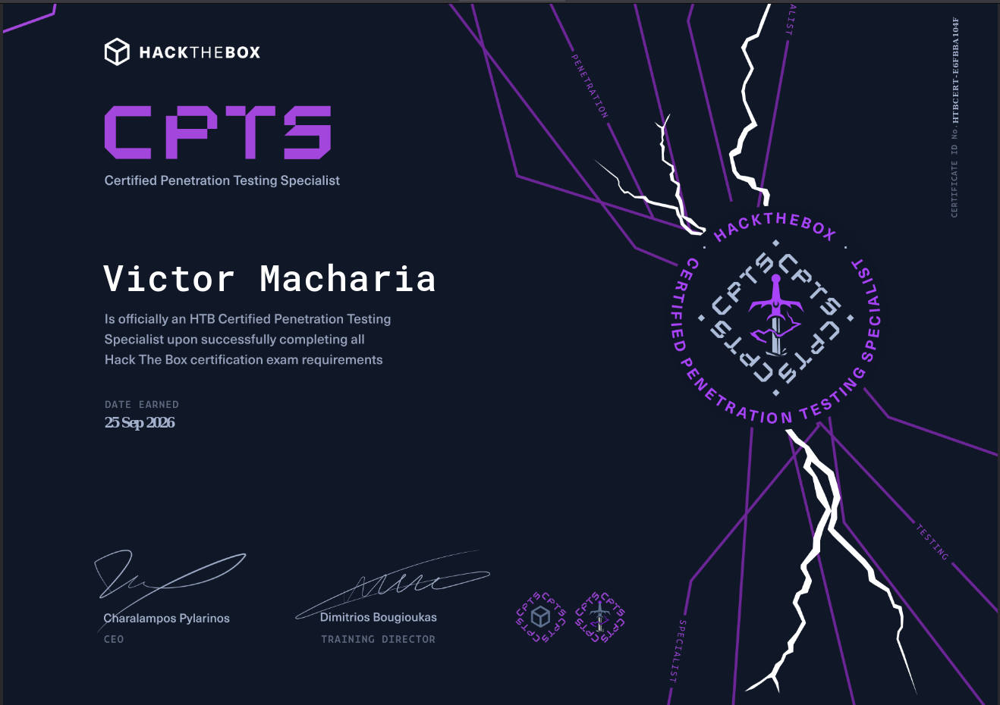
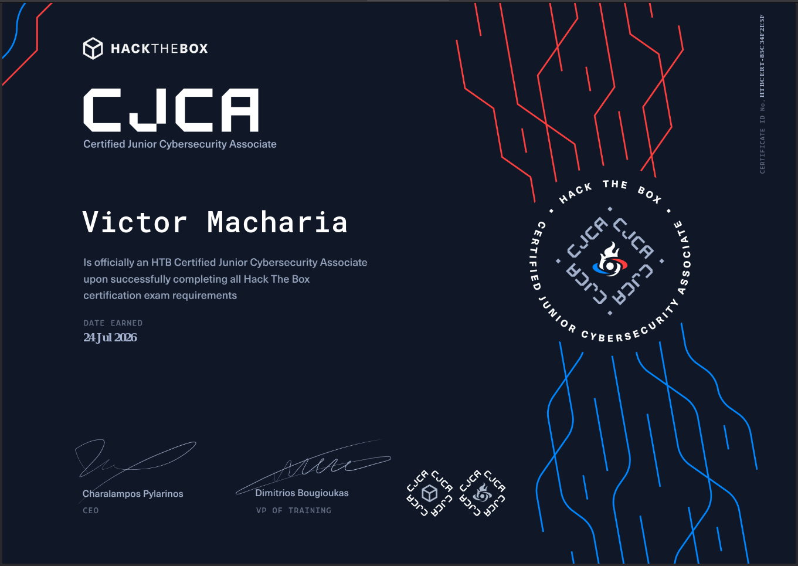
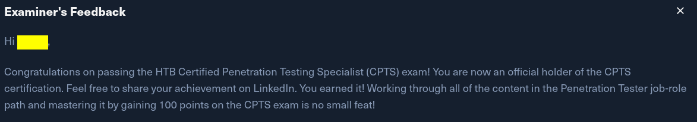

## Intro
I recently sat for two HTB exams: HTB Certified Junior Cybersecurity Associate (HTB CJCA) and HTB Certified Penetration Testing Specialist, and PASSED! It was one unique experience since these were my first two cybersecurity certifications, and I really had committed to getting certified. There are many firsts we get to go through in this life, but so far, in my 20+ years in this world, the feeling I got from this was unreal. I can't even explain it, but on Sep 25 when I got the results for my CPTS, I was so stunned and being a Friday afternoon, my whole world paused and I had to take time to review how much this meant to me. Heck I might have even shed a tear.

CJCA was equally satisfying but I never got to enjoy it as much since CPTS was right on the door knocking.

I'll explain this shortly, but let's go back to the beginning, how it all started.

## Placing a wild bet
During the Covid era, after having done an internship as a quality analyst at a local brewery (super awesome job), I found myself at a difficult place. I wanted to prepare myself for a career as a penetration tester, but first, with no computer science background, I had to figure out a way to learn IT foundations, then learn some programming, then later on get to ethical hacking. However, life was still happening (unemployed and broke), and in the midst of all this, I found a way to get into bootcamps and got the foundations I needed, plus a lot of self-learning. Then, at the end of 2021, once I found a John Hammond video talking about TryHackMe's advent of cyber program, and I got convinced to venture into the cyber space. A few years later, after working in the cloud space, playing CTFs and doing some challenges on HTB, I thought it was time to get certified. Cybersecurity certifications are quite expensive out here, especially if it's self-sponsored, so I had to review so many certs to pick the best one. Fortunately for me, I can't say I was completely a beginner, so I wasn't looking for foundational certifications. Instead, I had to do a certification that had to teach me stuff that I didn't know, be quite difficult (for the thrill), and be recognized out here. That's where HTB came in.

## Timeline
Last year, at around August, I purchased the HTB silver annual subscription, that was available on discount, had an offer to get two certs (CJCA and CPTS), and also free access to the modules and preparation path on HTB. In my opinion, at the time of writing, this purchase had the best return on investment. It set me back around 367 dollars, and at that time I thought that was the only investment I would make. After the purchase, I directly jumped to the modules to review the respective paths for CJCA and CPTS. And that's where some reality set in, there was time investment needed as well. I tried to start off immediately but with other commitments to work and other things, it became quite hard to keep up with the modules on a daily basis. And as if it would not get worse, I could also not keep up with the modules on a weekly basis. Fast forward to June 2026, my subscription was expiring in August, and I had not done any of the certs, and I also had not made any progress on CJCA, let alone CPTS. At this point, I told myself I had to do CJCA, and I'll push myself to get through with the modules in one month, which I considered easy in a way, and then convinced myself I will try to push through CWES (Certified Web Exploitation Specialist). This seemed way easier, and had shorter modules to prepare for, while CPTS had more modules and was way broader. I should also mention it was almost a year since I had been active on HTB, with very little activity in the last two years. So, I was a bit rusty. 

## Preparation Content
One of the things I have respected from HackTheBox is their top tier challenges and boxes, and having a chance to learn about some topics I struggle with through their platform was a bonus. The content was excellent, and I had a great time going through it. It can be overwhelming if your learning everything in a short period of time, and that's highly discouraged. But I had one advantage, I was quite free and little commitments, so I could easily spend 10+ hours everyday on July and August. This enabled me to complete the CJCA path in less than three weeks, and the CTPS path took me 4 weeks to complete.  After finishing the CJCA path, I immediately jumped into the exam on July 11th, and I did it in 5 days. I couldn't even take a break as I waited for results, as I immediately jumped into the CPTS track. The subscription was expiring on Aug 18th, so I had to really move quickly. Also, before jumping onto the CPTS track, I really took some time contemplating whether I would finish the CPTS track in time, or if I needed to do the CWES track, which required less time and the content was relatively easy. Well, it did not take long to come up with a decision, since I wondered, since when would a grown man shy away from an exam or content since it's challenging?! I mean whatever happens happens, but I just had to go for what I aimed for. Another thing, active directory and windows were some topics I had not covered well since I started doing challenges. I mean, I have rooted one or two medium/easy windows boxes on HTB since I started, but then, that's all the experience I had. The hesitation to go for CWES was probably valid, but then, I knew I wouldn't be happy if I got certified in CWES. Going through the CPTS modules in 4 weeks was a great challenge, some modules like the Active Directory module takes 7 days to complete, and other medium-level modules like Windows privesc took 4 days. The whole path is structured to estimated to take around 42 days, but it probably takes longer for people new with some of these concepts. I really pushed myself, and I think I got to through with it in the short period since I took a lot of time with the modules I wasn't familiar with, and then rushed through some of the newer modules. At around Aug 12, 5 days to the deadline, I had three modules remaining, each taking a respective 4 days to complete. But I got through with it, heavy on coffee and some life motivation. Needless to say, it's not recommended to rush through the modules, it defeats the purpose of learning, which is the main point here. Also, the burnout that comes after this period, is something else entirely.

## Exam Experience
Starting with CJCA, I would say the exam is not difficult. Comparing it to HTB boxes, I would say it was the harder side of easy-ranked machines. There's an attacking and defensive portion, the defensive portion is quite enjoyable, you get to learn how defenders and blue-teamers see your activity and also understand how to flag false and true positives. The attacking portion is also enjoyable, but if you're a bit rusty, might spend more time than you need to on certain parts, but within the 5 days period, you surely will get through. Requires less overthinking, and following a simple structured methodology. You get to compromise 5 machines, which you should have an easy time doing so if you have been actively hacking or doing boxes on the platform. Now CPTS, is not at all easy. I mean, the path and modules themselves have already shown you this, so compared to boxes on HTB, I would this is like compromising insane machines/boxes, but like three or four of them. There's a ton to learn, and I really had fun with this. The path teaches you to be tool-agnostic, and also understand the why behind everything you do. I was using a lot of the tools for the first time during the exam, and it also made me understand why it's better to use some tools instead of others e.g. a tool might break the server you're trying to get into, and that's not what you want in a real engagement. The exam felt like it took forever, at some point I got stuck, and I questioned my sanity and will to live. I would get a flag, feel excited, and then go back to, 'oh here we go again, digging to find the next'. Compromising around seven machines is not a walk in the park, and the 10 days feel long and short at the same time, but it's one of the best experiences I've had. Reporting, another challenge. This is heavily emphasized and for a good reason, since hacking is cool and all, but explaining your findings and recommendations to a non-technical and technical audience makes it all worthwhile and meaningful. This is a part I intend to improve well on, I was thinking to create a tool to assist with this, but a tool already exists called SysReptor for the same task. However, I find pentest reports can be customized in different ways, and these customizations need better flexibility, that I'm not sure SysReptor does well. I used Microsoft Word to write the report, which also meant that I needed to use Windows as an attack host, so that I can easily document findings on the same machine. To be fair, using Windows was a good experience that I actually loved, but I prefer to use my arch linux attack host for penetration testing assessments.

## Tips, Tricks, Takeaways?
Some tips about CPTS in case you're feeling a bit scared or nervous:
- Doing CJCA first was a really good plan, felt like I've been preparing forever for this exam
- Taking time to do the exercises and labs on the modules, without any assistance, helped understand concepts well and much faster
- It's not at all easy, this exam will test you; your will, sanity and purpose on earth 
- Believe in yourself, take less time reading opinions from strangers out here; if I followed what people say on Discord or Reddit I probably would not have attempted CPTS
- There's never a 'right time' to do anything, just do it there and then, with all your grit and might.
- Have fun with it! It's an exam yes, but it's meant to simulate a real world enterprise network, and you're getting to hack into it ethically, and you already know it's intentionally vulnerable, so there has to be a way to get in, which should get you motivated to keep going

## Conclusion
I got all the flags in both exams; 5/5 for CJCA and 14/14 for CPTS.

It truly was an experience writing about. I have done more certifications on AWS, Linux, Azure and some other challenges out here, but this one gave me a satisfaction that I never felt before. Maybe because it was a technical exam, rather than an exam with dumps all over online. But anyway, on to the next challenge! Cheerio!
