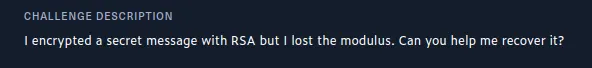

### Intro

An **easy-rated** (and retired) cryptography challenge from HackTheBox, with the following description:



Lost the modulus, huh?!
(This post assumes you’re familiar with Python and some basics of asymmetric cryptography, specifically RSA)

### Solution

Let’s download the challenge files, and `unzip` to a custom directory, as shown below (before unzipping, I like to view what files are inside):


Now we have two files; an `output.txt` file containing the hex-encoded version of our encrypted flag, and a `challenge.py` file. Here’s the contents of the latter:

```python
#!/usr/bin/python3
from Crypto.Util.number import getPrime, long_to_bytes, inverse
flag = open('flag.txt', 'r').read().strip().encode()

class RSA:
    def __init__(self):
        self.p = getPrime(512)
        self.q = getPrime(512)
        self.e = 3
        self.n = self.p * self.q
        self.d = inverse(self.e, (self.p-1)*(self.q-1))
    def encrypt(self, data: bytes) -> bytes:
        pt = int(data.hex(), 16)
        ct = pow(pt, self.e, self.n)
        return long_to_bytes(ct)
    def decrypt(self, data: bytes) -> bytes:
        ct = int(data.hex(), 16)
        pt = pow(ct, self.d, self.n)
        return long_to_bytes(pt)

def main():
    crypto = RSA()
    print ('Flag:', crypto.encrypt(flag).hex())

if __name__ == '__main__':
    main()
```

Now, from the `main` function, the output we’re getting is only the flag, which is saved inside the `output.txt` file. Now, if you have no clue why the code above isn’t secure, then you’ll probably enjoy this writeup, as I try to break it down from a noob’s perspective. So, first I’ll create a test folder, copy that script, and create a dummy `flag.txt` file. Then, I’ll print out the most important variables or elements of `RSA` cryptography: `p`,`q` and `m` — `e` has already been hardcoded (`3`), and the rest can be calculated. To do so, I’ll add the below line in the constructor( `__init__`) function, to print out the hex representation of those values (**hex -** for better visibility and simplicity)

```python
print(f'p = {self.p:x}\nq = {self.q:x}\nm = {flag.hex()}')
```


So, generally, this is how RSA works; if you have a message `m`, to get its encrypted value via RSA encryption, you’ll get the value of `m` to the power of your public exponent `e`, and then use that value to get the remainder when divided by the modulus `N` . If you find yourself ‘floating’ here, I’ll try my best to break it down below in Python (but please go ahead and ask *chatGPT* to simplify how RSA works, it’s going to make it way easier than I can here).

```python
# VARIABLES
# m = initial message
# e = public exponent
# N = modulus (usually a product of two primes, p and q i.e. N = p*q)
# c = encrypted message after encryption (ciphertext)

# ENCRYPTION
c = pow(m,e) % N

# DECRYPTION
# phi = (p-1)*(q-1)
# d = pow(e,-1,phi)
m = pow(c,d) % N
```

Now, from our variables shared above, let’s try to step through the RSA encryption process, and see how the variables change. Before you read the next steps, do you see something odd? Take a few seconds here:


You see it? Yeah, the modulo operation isn’t changing our variable in any way i.e. `pow(m,e)` has the same value as `c` , which is the value obtained after `pow(m,e) % N`. But why is that? From the basics of modular arithmetics, the value to the left-hand side of the modulo operator will always be given as a result if the modulus (value on the right-hand side) is larger than it i.e.


From that, that means that our encrypted message can be represented as follows: `c = pow(m,e)`, without the modulo operation. Now, since we know `e` is 3, can you guess what to do next? That’s right, cube root. But wait, it’s not that simple, we’re not getting the cube root of 8 — we’re dealing with a very huge number, and getting the cube root is not very straightforward.


The above represents a comparison between the value you’re getting after doing a basic cube root operation and the actual value you’re supposed to get. To get the actual cube root, I wrote this script a while back, which basically does some sort of binary search:

```python
t = int(c ** (1/3))
e = 3
factor = int(1e13) # roughly between 2**43 and 2**44

while True:
        t += factor
        test = t ** e
        if test == c:
                print("! found it: " + str(t))
                exit()
        if test > c:
                t = t - factor
                factor = factor // 2
```

Alternatively, I can’t remember where I got this exactly, but it’s way easier to use, and gives results instantly:

```python
def root3rd(x):
     y, y1 = None, 2
     while y!=y1:
         y = y1
         y3 = y**3
         d = (2*y3+x)
         y1 = (y*(y3+2*x)+d//2)//d
     return y
```


Finally, we get the actual value of `m`, and we can now proceed to convert it from `int` to `str` , and we can recover our message, and hence our `flag.txt`


I pixelated the flag content, cause I thought to try out pixelating images, and I heard it’s no longer secure. Can we find a way to recover our flag from that image? Our next challenge. Next time✊🏽.

