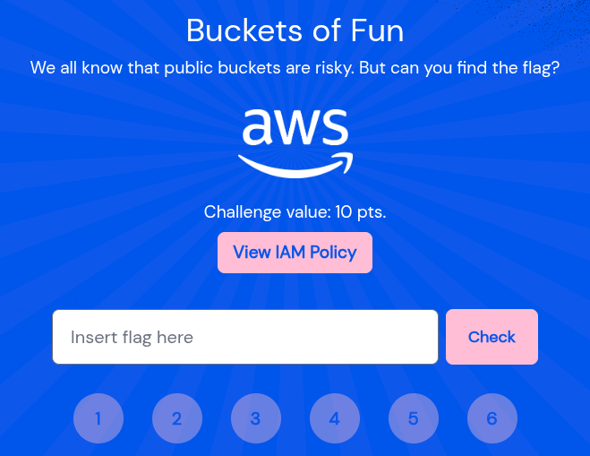

You can check out this challenge here:  [link](https://bigiamchallenge.com/challenge/1) 

There are a total of 6 challenges, but I’ve documented the first four, since I ran into deprecation issues with the AWS api that made challenge 5 difficult to progress with. Hopefully I’ll update that soon enough.

### **Challenge 1 — S3**

Here’s the IAM policy we get to work with:

We have an S3 bucket that we can list and also retrieve objects from. Let's try to list it first;

We have a **prefix** (Amazon S3 folder), from which we already saw defined in the policy, called **`files/`**. To view the objects inside, let’s add a recursive option to the command at the end i.e. **`--recursive`** 

We can now see the two files in the *files* folder; of course, we want the flag. We could download it as an object in the `/tmp` directory, since it is the only directory we have write permissions in our environment, or just pass the contents to the standard output without having to save them to a file. Choosing the latter, we can use the `cp` command to achieve this, thus printing out the flag.

### **Challenge 2 — SQS**

The challenge is hinting at a **queuing** system. Let’s view the IAM policy:

Our IAM user can send and receive messages on the queue listed. Let’s try to view messages from that queue using the syntax below:

`aws sqs receive-message --queue-url <URL>`

We get one message from the queue, which appears to have an interesting URL and a User-Agent. Let’s `curl` the URL and see what happens:

### **Challenge 3 — SNS**

Push notifications? Probably some notification service. Let's have a look at the IAM policy:

From our policy, we can subscribe to an SNS topic, implying that we can receive notifications to an endpoint that we specify. Let’s try to subscribe to our topic, and from the `awscli` SNS docs, two arguments are required: `--topic-arn` and `--protocol`. From the policy above, we also need to specify a notification endpoint that ends with the suffix `@tbic.wiz.io`.

The `*` at the start of our endpoint condition means any characters can appear before our endpoint, which is quite dangerous, and therefore for our case, I’ll choose HTTP protocol since we can append the specified suffix to our HTTP URL as a path (using `/`).

The ‘pending confirmation’ message is waiting on us to confirm our subscription, which can access

On my machine, I already setup a HTTP listener and then set up a reverse proxy through an external service (`pinggy`), and this is the response I get:

We have a `SubscribeURL` field that contains a URL which we can visit to confirm our subscription to that topic, which can be achieved using `curl`:

Now that our subscription is confirmed, we should start receiving notifications on our endpoint, which we can see on our local listener every minute:

### **Challenge 4 — S3**

Let's review the policy:

This challenge is quite tough if you just look at the policy unless you already know what's wrong with it. The principal ARN condition does not put enough constraint on who can access the bucket, and for our case, it does not restrict us from accessing the bucket when we send unsigned requests.

You could also test the unsigned request using `curl`, though you get annoying XML output.

We can then print the flag even with a signed request since the GetObject operation is unrestricted.

### **Challenge 5 — Cognito**

Here's the IAM policy:

